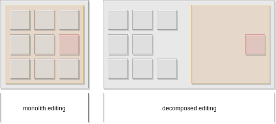

# What is QML Core UI

> No matter what the problem is,
> it's always a people problem.
>
> - Jerry Weinberg

!!! abstract

    CoreUI was created out of the need for a more structured way of creating User Interfaces (UIs) not only for applications but also for large systems. The traditional process worked fine if only a few people work on a user interface. But, as the user interface starts to get bigger and the number of people working on the UI layer increases, then the existing process was no longer well defined. It doesn't scale smoothly. Ideally, CoreUI provides a pattern to scale UI development linearly without scrutinizing the implementation of UI features.

## Motivation

When observing developers who are working on larger UIs, it is interesting to see the correlation between the development productivity and the UI complexity. Particularly, the development productivity drops as the UI complexity increases.

For example, developers need to start the whole UI to navigate into a detailed view to fine-tune some UI logics or an animation. Often, this is caused by the UI that can't be broken down into smaller, manageable chunks. In practical terms, it is about isolating a smaller portion of the UI and being able to work and validate this smaller portion. Breaking down the UI often happens on larger layers. But for UI development, where the UI experience is an important factor, it is necessary to fine-tune small aspects of the UI to achieve the desired look and behavior. You have to aim for a fast (< 1s) round trip time to make the conversation seamless between Design and Development.

In order to achive this, you need to be able to decompose (break down) the UI into smaller parts and being able to run these parts standalone. This will allow you to focus solely on the user experience of that particular part and allow a faster cycle of edit-build-validate.

You can easily avoid this situation with Qt and QML. While QML offers a great component model, it lacks a coherent approach to componentize the UI and to implement these UI components.

Looking at the current development approach, it is clear that the UI's physical structure and the component types are created by following a UI specification or Information Architecture and not from a technical perspective. For a developer, it is unclear when and how exactly to split a component into smaller parts, where to place them and to ensure a component is truly reusable as well as usable outside of its context.

CoreUI is an attempt to create an architecture and process to streamline this component creation task, similar to a component factory.

## What is CoreUI?

CoreUI is set of patterns and components to support a common user interface structure. It encourages both developers and designers to create a great user experience by focusing on the UI creation process. The CoreUI architecture is the result of the creation and re-creation of user interface projects for various markets, especially the automotive one. After several re-creations of user interface projects for vertical markets, some patterns emerged. The CoreUI architecture as presented here is the distillation of these patterns.

CoreUI is an embedded development framework using Qt5 and the QML/JS language. Programming embedded software user interfaces can often be unnecessarily complicated. CoreUI makes the programming of these user interfaces easier, by making assumptions about what every developer needs to get started to create stunning user interfaces. It allows developers to write user interface while accomplish more. CoreUI aims to bring back the fun and creativity to user interface development so that developers and designers can focus on the user experience again.

CoreUI is based on the opinions of others. These opinions make assumptions about what is the best way to create user interfaces. CoreUI is meant to be used that way and discourages other ways. If you master CoreUI you will probably experience a spike in productivity. If you keep up with your old habits and try to retrofit CoreUI with your old ways of working you may not reap CoreUI's full benefits.

## What CoreUI is not?

CoreUI is partly a concrete framework but it is not an exact path; more as a guideline. Often during a project, not all of the requirements are foreseeable and it is necessary to deviate from the suggested path.

CoreUI is not an implementation of a user interface.

CoreUI is not final :-)

## CoreUI stack

CoreuI is founded on top of Qt5 and Qt Automotive Suite.

**Qt5** is the leading cross-platform native UI toolkit with an unprecedented focus on the user experience. It offers the developer all the necessary APIs to develop a truly native cross-platform application.

**Qt Automotive Suite** extends Qt5, bringing multi-process application capabilities and a service framework to the table. By this, Qt Automotive Suite is extending Qt into the space of creating multi-process user interfaces for mid and high-end embedded systems. Even if Qt Automotive Suite targets primarily the automotive market, it's not limited to this market.

**CoreUI** defines patterns and rules for the UI layer of a multi-process UI for embedded systems based on Qt Automotive Suite. A reference implementation of CoreUI is the Neptune3 UI which is delivered together with Qt Automotive Suite.

