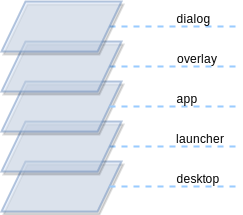
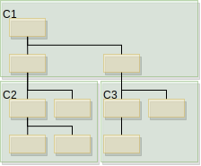
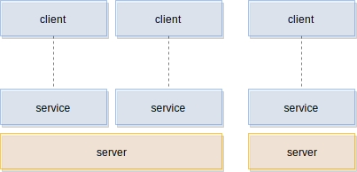

# Building Blocks

!!! abstract
    Building blocks are loosely coupled concepts which when arranged in the right order they form the foundation of the CoreUI. Through the loose coupling, you can also create a different architecture. This follows the principle that CoreUI is an opinionated stack and as such reflects our best efforts. Don't expect ready-made code solutions, these are concepts.

## User Interface

We consider the user interface as the front-facing interface towards the user, aka front-end. For the underlying system facing interface, we use the term back-end. The front-end is concerned about the visual integrity of the UI and its appeal. A special focus lies upon the dialog with the user interface design team to create a stunning user experience for the users as one.

The User Interface requires to communicate with the underlying system services as well as with services outside the system (aka remote services). The user interface is responsible to render every pixel on the screen and to achieve being an emotional user interface using animations and transitions.

Typically a user interface is seen as a user interface tree, where the root is the initial UI portion being loaded. It is important that the user interface has control about which portions of the UI are loaded as the UI is the only layer which has the understanding.
The user interface is typically developed in QML/JavaScript and Qt/C++.

!!! note

    Describe the definition of the UI and the different building blocks (e.g. SUI/AppS/UIControls)

The user interface is the highest layer inside a system. It offers information and interactions to the user. It is driven by the information architecture specification and the user-interface design specification. The central screens of a user interface are typically centralized inside the system UI. These screens are used to show to the user frequently needed information but also other information and interactions to navigate deeper into the user interface.

The user interface itself is often seen as a tree of user interface elements, where on the root level you have the display and the structure follows on the high level of the information architecture. There are often links between unrelated UI nodes which provide shortcuts to the user to show or retrieve certain information. The UI tree on the higher levels is also divided into UI layers to ensure the most important information is shown above other less important information.

The user interface is framed by the requirements specification, the user interface specification, the UI testing, and the underlying system.


For working on a particular software layer it is always important to understand and embrace the adjacent layers. Here the user interface developers work closely together with the design team that creates the user interface specification. The requirements team provides non-functional and functional requirements which need to be adherent by the UI developers. The testing team needs to have support to allow smooth planning of the user interface layer. And the system provides the foundation where the user interface can be executed (either desktop or embedded) and also provides the underlying services the user interface needs to interface with.

## UI Runtime

A runtime is responsible to initialize the user interface library and load a minimal set of extensions that are required to load the initial UI. From then on, the UI itself will take control of the loading of other UI parts.


```sh
runtime --import imports Main.qml
```

Often a runtime is made using a configuration document which can be written in JSON or a similar data-interchange format.


```json
{
  "imports": [
    "imports"
  ],
  "document": "Main.qml"
}
```

In the Qt/QML case, the default runtime is the qmlscene which is great for simple prototypes but for a more complex project you want to create a custom runtime, especially for loading your custom boot extensions.

## UI Extensions

An extension extends the runtime with new features and capabilities on dynamically on runtime. They are delivered as a module and typically loaded on-demand from the UI code. In the Qt/QML context, the extensions are called QML plug-ins. An extension, in general, can extend the runtime horizontally with new capabilities (for example to render a new type of content) or vertically (for example to communicate with a tuner service).


Loading the extensions on demand allows the execution from different code paths using different extensions. Also as the extensions are looked up using the import path you can inject a mock extension into the import path before the real extension for test purposes.


!!! note

    These extensions can be either written in QML or in Qt/C++ (or mixed). Often a developer first starts to write some extensions in QML for prototyping and later those will be re-written as C++ extensions to use a browser API and achieve the best performance.


## System UI

The UI started first is called the System UI. Think about your user interface and remove all applications, what is left is called the System UI. The System UI is responsible for booting the user interface system efficiently enough so that a minimal usable user interface, is operational by the user, is reached to be shown on the screen. The System UI is also responsible for layout application windows and to provide additional information overlays to the user. Another important point of the system UI is to act as a gateway to control and prioritize access to the display surface for dialogs and notifications. Lastly, it's responsible for displaying the application launcher that acts as a shell to launch applications.

* Boot the user interface until a minimal usable state is reached
* Layout application window surfaces
* Control display access for dialogs and notifications
* Manage user interface overlays
* Present a user interface to launch applications

### System UI Layers


The System UI defines the fundamental visual layering structure of the user interface. It creates the main rendering surface and controls other applications and dialog windows. A typical System UI can be divided into several layer containers.
The visual topmost layer is the dialog layer which displays notifications. The notifications are system-wide controlled allowing the system UI to decide when and how a notification shall be displayed, as another, more important, the notification may be currently displayed.

Just below the dialog layer, lies the overlay layer. This layer provides additional, not primary, information to the user, enhancing the information awareness and providing shortcuts to frequently used functions such as volume, climate information, etc.

Below the overlays there are the application surfaces, that is a standard way to extend the system UI using features packed into applications. An application is mostly displayed full-screen but can also have different states, for example when used as a widget to preview and/or interact with certain application information in a condensed way.

The launcher finally displays all available applications. A traditional way to display the different applications is using a grid with icons and a small text containing the application name and when this is clicked to launch the respective application full-screen. Another possibility could be to use a flexible grid of application widgets which when each is clicked expands into a full-screen application. The advantage of the first approach is that the application doesn't have to be launched but only meta information is presented (like its icon and name).

Below the launcher, there could be an optional background image, e.g. the desktop background.



In QML code this would roughly look like this.

```qml
// Display.qml
Item {
  id: root
  Image {
    id: background
  }
  Container {
    id: launcherLayer
  }
  Container {
    id: appLayer
  }
  Container {
    id: overlayLayer
  }
  Container {
    id: dialogLayer
  }
}
```

Stage Loading
=============

To allow the System UI to be launched in a controlled and efficient manner the typical way is to stage load the SysUI. Stage loading is a practice to dynamically load partially user interfaces using a state machine or a similar controller which is controlled by external information and/or the current state of the machine.


For this reason, the UI tree represented by the System UI has to be divided into smaller parts that can be loaded independently. The partitioning is done using a standard component approach and the loading is done using the Loader type which is directed by an SCXML state machine. The state machine state changes are triggered by either external events and conditions and the overall loading state.

!!! note

  For development purposes, it is also possible to shortcut some loading stages.

## Application

An application is a set of UI screens that represent the same logical context and are rendered into the same window surface. In a multi-process system, an application is started into its own process. An application should share ideally only a small and generic API with the other horizontal components (System UI, other applications) on the same layer and use a vertical communication to interface with the system.


The System UI is also seen as a special application which responsibilities are specialized in the sense that it is responsible for the early UI startup, managing application windows and displaying a UI to launch these applications as extensions to the UI. Using an application does not have to be the only way to extend or structure the user interface.

A small portion of the application will interact with the system UI and window handling. These parts shall be refactored out into own components. Similar is true for application logic interacting with the underlying services. That user interface portion of the application ideally should not expose services to the UI, it should instead be wrapped into an own module bundling this application logic and empowering this way better testability.

## Communication

There are several interfaces defined where an application can interact with the rest of the user interface. In general, it is prohibited that an application directly communicates with another application. These communications should always be routed either through the system UI or the underlying services. If the interface shall also be used by for example other displays, the information is better routed through a service. If the information is only relevant for the current display it shall be routed through the system UI.


In general, we talk about horizontal communication if an application talks to the system UI and vertical communication if an application talks to a service.


## UI Types

The user interface follows a hierarchical tree structure. Each node displays a fragment of the information or is used to structure the user interface. Some nodes inside the UI tree have a special purpose and ensure the tree has clear border lines and certain areas do not get exposed to unnecessary dependencies. Adding a dependency to a UI element makes it harder to test it or to launch it independently from the rest of the UI tree. But this should be our target to test and launch individual UI components independently from each other and thus creating an environment where adding more UI elements not necessarily slows down the process.




The most prominent UI type is the component. It encapsulates a portion of the UI tree and uses other components to delegate rendering of the required information. As such it provides a higher level of abstraction (`C1`, `C2`, `C3`) to a UI feature. These components form an own hierarchy within the UI tree and are used as the base for further specializing components.


In general, we differentiate between UI primitives (e.g. rectangles and images) and controls (e.g. buttons) as individual UI types. To combine several UI types panels or views shall be used. These are specific container-types to layout other containers as child UI types or controls. UI primitives are only used inside controls, as the controls have support for styling the UI. The difference between a panel and a view is that the view interfaces with the stores (the business logic layer of the application) but the panel not.


## Services

Service offers a feature to the user interface or other services. Service is located from the architectural perspective below the user interface in a separate layer. Typically a service runs on a different process belonging to the platform. The service exposes a client API which allows the client to access the service. Service is normally started by the system but often can also be started on demand when first used by the client through its API.

Services are bundled into a server. A server can contain one or more services. Each service exposes an API to the clients. Typically a service interfaces with the system or external services. Ideally, a service provides the data in a way that clients can easily consume them efficiently. The generic APIs will increase the work needed on the client side to gather all relevant data for a UI view.



Services shall be constructed as micro-services and should not directly depend on other services or services APIs. If there are needs for some dependencies between services it is better to use some form of an ID (e.g. a text identifier) to identify the referenced information on the other service. It is then up to the service implementation to resolve the reference.


## Jobs

A job is a long-running piece of work which may return some results. A job execution length is long enough to disturb the UI from rendering. Typically this computing is done on a service in a different process but this is not always possible or desirable. To run a job on the UI process it needs to run inside a thread pool and the result needs to be reported back.

In QtC++ the easiest way of doing this would be the QRunnable in conjunction with the QThreadPool. In QML this would be the WorkerScript to execute a long-running JS script.

## Single / Multi Process

In a single-process architecture, all UI code is executed inside a single process. This makes the initial coding and architecture much simpler. A single process architecture lacks separation of concerns. All UI code can access all other UI code API surface and by this depend on each other. This can easily create dirty code when no experienced developers take part in a project. Also, the security means are nonexistent in a single process UI in comparison to a multi-process one.

A multi-process UI separates concerns into separate processes and uses the security system of the OS to isolate these processes. An application developer has no means of playing around with the system UI memory apart from the APIs offered to him. This allows for much better scaling of application development efforts as independent teams can work on independent code spots which are separated by process boundaries. Ideally, one team would work on the system UI process and the interface for applications whereas others would work on the applications themselves.

The CoreUI architecture is designed to support a single and multi-process architecture. The main difference between these two setups is the separation of applications into different processes.

## Debugging

Qt debugging is described at https://doc.qt.io/qt-5.10/debug.html and QML debugging is described here: http://doc.qt.io/qt-5/qtquick-debugging.html. This section is more about visual UI debugging techniques.

As the UI is composed of larger building blocks which the CoreUI Architecture forces to be of a specific type we can add debugging instruments into these blocks. For example, to visually trace views and panels the base classes can render their outline and by this allow a developer to validate its layout.


## Testing

CoreUI forces the developer to extract all business logic into stores. These stores are pure data elements and thus can be nicely tested. The UI shall be concerned only about the UI logic and not the business logic. Further CoreUI cuts the UI into smaller logical pieces called controls, panels, views where each of them has a defined dependency and such it is fairly easy to create a test harness for each of these UI elements.

Testing is an integral part of CoreUI. There are dedicated folders with test runners in QML and C++ to ensure your tests are bundled with the code.


## Inspection

Inspection appears when a running UI is inspected live. As a user, you get live insights from the running execution by using a console interface (for QML/JS) or via a visual interface (e.g. visualize the UI hierarchy, component boundaries, z-ordering), or through event reporting where events are logged more or less visually (e.g. events, signals). But also you want to inspect the communication the UI holds horizontally and vertically with the services.

Inspection can be either embedded into the process (e.g. into the runtime) or can be attached to a running process. The first case is great for deployment as the runtime is already enabled with the inspection UI but it might have an impact on the runtime performance. The other option is to launch an independent inspector tool (e.g. `GammaRay <https://www.kdab.com/development-resources/qt-tools/gammaray/>`) and attach it to the running executable. This inspector tool comes with a dedicated user interface to help you understand the UI execution flow but also being able to manipulate certain values.

## Package Manager

A package manager allows the user or the system to install a binary package. There are two different package types: application and system packages.

The application package is used to install and remove an application. It is designed to be easy to use and to bundle all dependencies into the application package. It relies on a refined version of the platform.

The system package is a bundle which also contains dependency information and may even run some initialization scripts. The number of features depends on the package system used. This allows a system builder to build a new version of the system and ensure all dependent packages will be also installed.

The application package is designed to be self-contained, for security and stability issues. It is not allowed that an application package modifies the system, by e.g. installing a depending service or a new version of a library. Allowing this could lead to an unstable system.

It should be noted that it is possible to wrap an application package into a system package. The system package installer would then run the application package manager to install the bundled application. Normally this does not work in reverse: An application package to bundle a system package.
