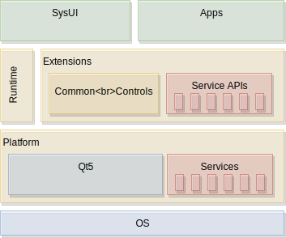
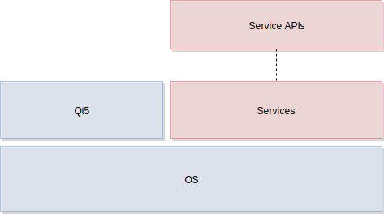

# User Interface Layer

The UI is the topmost layer in our software stack. It presents the user with important information and offers interactions to the user. It communicates vertically with the services.


## Blocks of the UI Layer

The UI layer is divided into the system UI (SysUI) which acts as the bootstrapping UI, the application UIs (AppUI) and the Common Controls library as also the UI style definition as part of the controls library. The service APIs are used to communicate vertically with the underlying middle-ware services. The UI uses the Qt5 UI toolkit to render the user interface but also to use its platform abstraction to allow the user interface layer to run on various supported platforms.




The UI layers follow a defined folder structure to be able to grow the UI in a controlled way, across teams.

## UI Tree


We see the user interface as a tree of components. The root component often called `Main.qml` will import and create other child components and by this form the UI tree. Applications introduce boundaries into the tree. In a multi-process user interface these boundaries are created using processes. In the tree a window handle is used to keep track on the application process window. The window information is mirrored inside the application window surface. Other UI elements will then be childs to the window surface and continue the UI tree. In a single-process UI there are now windows for applications and an application boundary is just created by the physical location of the code.

!!! note

	Create a diagram for UI tree

The UI tree allows us to see the user interface layer not as a monolith it rather allows us to see the UI as a tree of sub-trees. And each sub-tree when it dependencies are satisfied can be run independent. To run a sub-tree in the simplest form your runtime will just load a different QML component then the `Main.qml` document.

Passing the initial root document to the runtime is an important aspect of staying agile. As only this approach allows us to load partially UI trees.

Based on the initial document loaded and the to be created sub-tree the UI may have different dependencies. It is important to understand the layers below the user interface to understand the UI layer itself.


## Beneath the UI Layer

The platform, in general, encompasses the OS and the Qt5 UI Toolkit together with any custom Qt5 platform adaptation. Often the platform team is also responsible to deliver the service implementations as also the client side service API in co-operation with the UI developers. The service implementation and client-side service APIs can also be seen as a task for a middle-ware team separated from the platform delivery, as there is much domain-specific knowledge required and adapting the service API towards the system is an effort where specialized knowledge is being required.



Eventhough the service blocks look small on the diagram, they can be very large as there are many different services even many different servers required to map a larger feature set for a UI into service APIs.


## Relocating the UI Layer

As the UI layer sits "only" on top of Qt5 and the Service APIs, it can be relocated onto another machine running a different OS. This allows the development of a host platform and using the services via an IPC protocol on the target device. This separation allows the UI layer to be developed independently from the HW if simulation services are available.


## Simulation Services

A simulation service is a service which exposes the same client API as the native service but has only a simulated implementation. The implementation can be fairly easy, e.g. using hardcoded data or it can be already rather complete, by providing behavior. Ideally, the simulated service is independent of the HW so that it can also be relocated. Also as a simulated service is often used to test certain conditions, it should be able to load different scenarios and simulate not only data but also behavior in a generic way.

A simulated service often uses a simulation framework to allow scripting of behavior and advanced simulation data generation. As a simulated service, it is not necessary to really do the thing, rather just to look from the API user perspective. For example in the case of a music player, it is not required to play back music, but rather change the API values about the current song, album the playtime and other properties.


Ideally, to support a flexible setup, there is a central document which lists all services and allows the developer to easily switch from a simulated service to a native service. If all services are not depending on each other, then directly these switchings should happen without a considerable side-effect.

In case a service is identified by an URI the listing could be something like this:

```yaml
org.example: tcp://localhost:8154/org.example
org.phone: simu://localhost/org.example
```

The first entry would use a TCP connection to connect to the service module discoverable on the port 8154. The second entry would for example use the simulation protocol to a central simulation server running on the localhost. These are just examples of a potentially deployment document and shall just display a potential way of encoding the information. The exact way depends on the used IPC technology.
